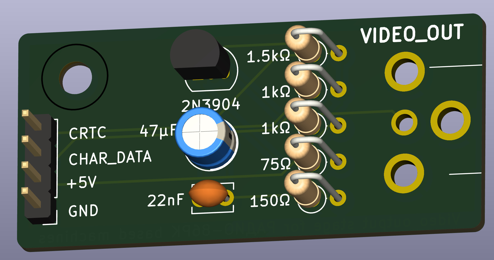
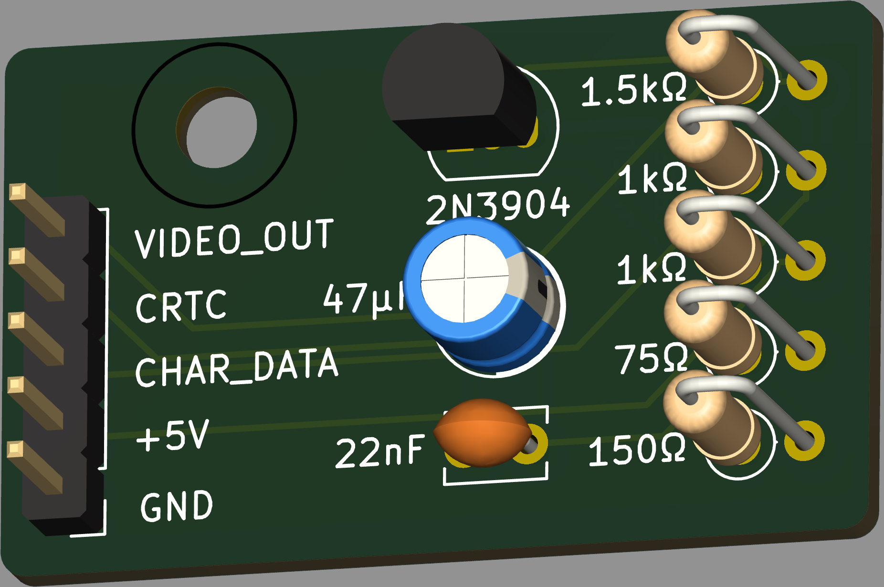

# Radio 86RK Video Output
The РАДИО-86РК was a Soviet-era homebrew/DIY computer based on their clone of the Intel 8080, the КР580ВМ80А.  [Sergey Kiselev](https://github.com/skiselev) has [made a very nice modern recreation](https://github.com/skiselev/radio-86rk) that, importantly, outputs a "composite" video signal. 

Well, the machine outputs a B&W-only video signal but you know what I mean. 

The Intel 8275 (Soviet: КР580ВГ75) generates horizontal (HRTC) and vertical (VRTC) retrace signals which are combined with the character bitstream (character ROM to shift register) to produce the video output.  The image above shows on scanline with text - the negative-going pulses are HRTC & VRTC, the positive-going are character bits. 

The schematic below is a simplified version of Sergey's schematic highlighting how the video signal is generated. 

Sergey's implemention additionaly includes the reverse video (RVV) signal but this isn't implemented in all versions of the 86RK, so I'm ignoring (for now). 

The 86RK was serially produced by various factories in the Soviet Union resulting in machines such as the АЛЬФА-БК, ПАРТНЕР-01.01 and УМПК-Р.  These machines all output an RF-modulated video signal which is not convenient these days.  

To simplify conversion of these machines' video output I thought it might be worth implementing Sergey's video output stage as a discrete module that could be installed in these older machines. 

## Status: UNTESTED
- 23-Nov-2024: initial design

## Versions
I've made two versions: one with an RCA phono jack for testing/troubleshooting a machine without modifying too much and a second with a pin header for installation into a machine.

### [RCA Jack](/RCA_output/)
Selected the "same sky" part RCJ-014 as the phono jack.  Kicad library & datasheet are incuded. 

### [PIN Header](/Pin_header_output/)

## Bill of materials
- 2 x 1kΩ resistor
- 1 x 1.5kΩ resistor
- 1 x 75Ω resistor
- 1 x 150Ω resistor
- 1 x 2N3904 transistor
- 1 x 47µF electrolytic capacitor (pitch 2.5mm)
- 1 x 22nF ceramic capacitor (pitch 2.5mm)
- 1 x M3 bolt/nut/washer/spacer (if required)

For RCA phono jack version:
- 1 x RCJ-014 (or similar) RCA phono jack
- 1 x 4-pin header (pitch 2.54mm)

For pin header version:
- 1 x 5-pin header (pitch 2.54mm)
